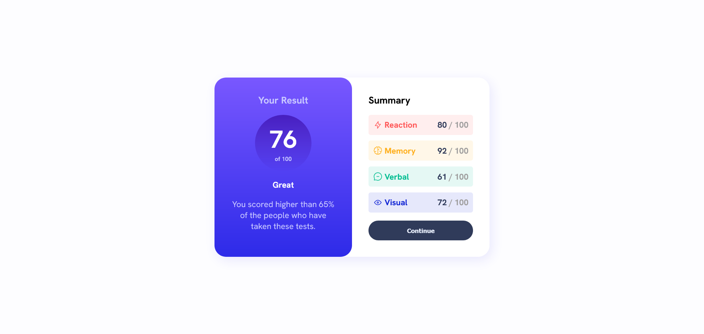

# Frontend Mentor - Results summary component solution

This is a solution to the [Results summary component challenge on Frontend Mentor](https://www.frontendmentor.io/challenges/results-summary-component-CE_K6s0maV). Frontend Mentor challenges help you improve your coding skills by building realistic projects. 

## Table of contents

- [Overview](#overview)
  - [The challenge](#the-challenge)
  - [Screenshot](#screenshot)
  - [Links](#links)
- [My process](#my-process)
  - [Built with](#built-with)
  - [What I learned](#what-i-learned)
  - [Continued development](#continued-development)
  - [Useful resources](#useful-resources)
- [Author](#author)
- [Acknowledgments](#acknowledgments)


## Overview

### The challenge

Users should be able to:

- View the optimal layout for the interface depending on their device's screen size
- See hover and focus states for all interactive elements on the page

### Screenshot




### Links

- Solution URL: [Github](https://github.com/efosu/Frontend-Mentor---Results-summary)
- Live Site URL: [Frontend Mentor](https://efosu.github.io/Frontend-Mentor---Results-summary/)

## My process


### Built with

- Semantic HTML5 markup
- Flexbox
- CSS Grid


### What I learned

Using fetch api to get data.


```js
fetch('./data.json')
    .then(response => response.text())
    .then(body => JSON.parse(body))
    .then((data) => {
    const cat_number = data.length;
    if (cat_number == 0) {
        summary_div.textContent = "No category to display";
        summary_div.classList.add('summary_empty');
    }
    else {
        summary_div.classList.remove('summary_empty');
        data.forEach((div => summary_div.appendChild(create_category_div(div))));
    }
    ave_span.textContent = get_average(data);
}).catch(() => {
    summary_div.textContent = "No category to display";
    summary_div.classList.add('summary_empty');
});
```


### Continued development

Html 5 accessibility and animations

### Useful resources

- [CSS_ The Definitive Guide_ Visual Presentation for the Web by Eric A. Meyer & Estelle Wey] - This helped me for styling the layout with grid and flexbox. 
- [Understanding ecmascript6 by Nicholas C. Zakas]-This helped me to use the fetch api for getting data.


## Author

- Frontend Mentor - [@efosu](https://www.frontendmentor.io/profile/efosu)


## Acknowledgments

Really thank Eric A. meyer , Estelle Wey and Nicholas Zakas with the contributors of frontend Mentor for providing useful contents and challenges for me.

